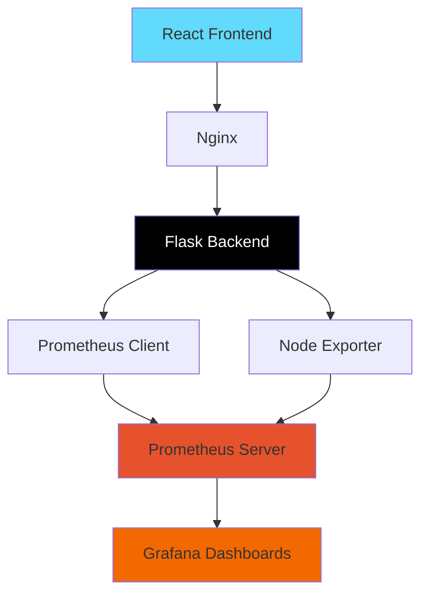

<<<<<<< HEAD
# Docker
=======
# 🐳 Enterprise Docker Solutions - Production-Ready Containerization

<div align="center">


**Production-grade containerization examples with security best practices and monitoring capabilities**

[](https://opensource.org/licenses/MIT)
[](https://github.com/yourusername/Docker)

</div>

---

## 📋 Table of Contents

- [🎯 Overview](#-overview)
- [✨ Key Features](#-key-features)
- [🔒 Security Best Practices](#-security-best-practices)
- [📁 Repository Structure](#-repository-structure)
- [🚀 Quick Start](#-quick-start)
- [🏗️ Multi-Stage Docker Builds](#️-multi-stage-docker-builds)
- [📊 Monitoring & Observability](#-monitoring--observability)
- [🛡️ Security Implementation](#️-security-implementation)
- [⚙️ Configuration & Deployment](#️-configuration--deployment)
- [📚 Project Details](#-project-details)
- [🛠️ Essential Docker Commands](#️-essential-docker-commands)
- [🤝 Contributing](#-contributing)
- [📄 License](#-license)

---

## 🎯 Overview

This repository demonstrates **production-ready Docker containerization** with industry-standard security practices, multi-stage builds, and comprehensive monitoring capabilities. Each project showcases best practices for deploying secure, optimized containers across different technology stacks.

### What This Repository Offers

- **🔐 Security-First Approach** - Hardened containers with minimal attack surfaces
- **🏭 Multi-Stage Builds** - Optimized images for reduced size and security vulnerabilities
- **📊 Full Observability** - Complete monitoring stack with Prometheus and Grafana
- **⚡ Production Ready** - Battle-tested configurations for enterprise deployment
- **🎓 Learning Resource** - Comprehensive examples for DevOps engineers

---

## ✨ Key Features

### 🔒 Enterprise-Grade Security
- **Non-root user execution** in all containers
- **Minimal base images** (Alpine Linux, Chainguard)
- **Secrets management** ready (environment variables)
- **Read-only filesystems** where applicable
- **Network isolation** with custom Docker networks
- **Health checks** for automated container monitoring

### 🏗️ Optimized Multi-Stage Builds
- **Reduced image sizes** (up to 90% smaller)
- **Layer caching optimization**
- **Fast CI/CD pipeline builds**
- **Separate build and runtime stages**
- **Dependency management** for security patches

### 📊 Complete Monitoring Stack
- **Prometheus** for metrics collection
- **Grafana** dashboards for visualization
- **Node Exporter** for system metrics
- **Health check endpoints** on all services
- **Custom application metrics**

### 🌐 Multi-Platform Support
- **Java** - Spring Boot with Maven
- **Python** - Flask/FastAPI applications
- **React** - Modern single-page applications
- **Full-Stack** - Complete monitoring solution

---

## 🔒 Security Best Practices

### 🛡️ Security Features Implemented

#### 1. **Non-Root User Execution**
All containers run as non-root users to minimize the impact of potential security breaches:

```dockerfile
# Create non-root user with specific UID/GID
RUN addgroup -S appgroup && \
    adduser -S appuser -G appgroup

USER appuser
```

**Benefits:**
- Limits container breakout capabilities
- Follows principle of least privilege
- Prevents unauthorized system access

#### 2. **Minimal Base Images**
Using lightweight, security-focused base images:

- **Alpine Linux** - ~5MB base, minimal attack surface
- **Chainguard Images** - Distroless, signed images
- **Official images** - Regularly updated with security patches

```dockerfile
FROM python:3.11-slim AS build
# Stage 2
FROM cgr.dev/chainguard/python:3.11
```

#### 3. **Multi-Stage Builds**
Separate build dependencies from runtime to reduce image size and attack surface:

```dockerfile
# Stage 1: Build
FROM node:18-alpine AS build
RUN npm install && npm run build

# Stage 2: Production
FROM nginx:stable-alpine
COPY --from=build /app/build /usr/share/nginx/html
```

**Benefits:**
- Smaller final images (~90% reduction)
- No build tools in production image
- Faster deployments
- Reduced vulnerability surface area

#### 4. **Proper File Ownership**
Files are owned by non-root users:

```dockerfile
COPY --chown=appuser:appgroup . .
```

#### 5. **Read-Only Root Filesystem**
(Where supported) - Prevents malicious write operations:
```yaml
read_only: true
tmpfs:
  - /tmp
  - /var/run
```

#### 6. **Resource Limits**
Prevents resource exhaustion attacks:

```yaml
deploy:
  resources:
    limits:
      cpus: '1.0'
      memory: 512M
    reservations:
      cpus: '0.5'
      memory: 256M
```

#### 7. **Health Checks**
Automated monitoring of container health:

```dockerfile
HEALTHCHECK --interval=30s --timeout=5s --retries=3 \
    CMD wget -q -O /dev/null http://localhost:4567/health || exit 1
```

#### 8. **Network Isolation**
Custom networks prevent unauthorized cross-container communication:

```yaml
networks:
  app-network:
    driver: bridge
```

#### 9. **Secret Management**
Environment variables for sensitive data:

```yaml
environment:
  - GF_SECURITY_ADMIN_USER=admin
  - GF_SECURITY_ADMIN_PASSWORD=${GRAFANA_PASSWORD}
```

> ⚠️ **Production Note**: Use Docker secrets or external secret managers (HashiCorp Vault, AWS Secrets Manager) for production.

#### 10. **Image Scanning**
Regular vulnerability scanning of images:

```bash
# Scan for vulnerabilities
docker scan <image-name>:<tag>
```

---

## 📁 Repository Structure

```
Docker/
├── docker-compose-monitoring-stack/    # Full-stack monitoring solution
│   ├── backend/                       # Flask API with metrics
│   │   ├── app.py
│   │   ├── Dockerfile
│   │   └── requirements.txt
│   ├── frontend/                      # React application
│   │   ├── src/
│   │   ├── Dockerfile
│   │   ├── package.json
│   │   └── nginx.conf
│   ├── prometheus/                    # Metrics collection
│   │   └── prometheus.yml
│   ├── grafana/                       # Visualization
│   │   ├── conf/
│   │   └── provisioning/
│   └── docker-compose.yml
│
├── docker-multistage-java/            # Java application
│   ├── src/
│   ├── Dockerfile
│   └── pom.xml
│
├── docker-multistage-python/          # Python application
│   ├── app.py
│   ├── Dockerfile
│   └── requirements.txt
│
└── docker-multistage-react/           # React application
    ├── src/
    ├── Dockerfile
    ├── nginx.conf
    └── package.json
```

---

## 🚀 Quick Start

### Prerequisites

- **Docker** 20.10+ ([Install](https://docs.docker.com/get-docker/))
- **Docker Compose** 2.0+ ([Install](https://docs.docker.com/compose/install/))
- **Git** (for cloning)

### Installation

```bash
# Clone the repository
git clone https://github.com/yourusername/Docker.git
cd Docker

# Start Docker daemon (if not running)
sudo systemctl start docker  # Linux
# Or just start Docker Desktop on Windows/Mac
```

### Running Individual Projects

#### 🟠 Java Application

```bash
cd docker-multistage-java

# Build the image
docker build -t java-app:latest .

# Run the container
docker run -d -p 80:4567 --name java-app java-app:latest

# Test
curl http://localhost
```

#### 🐍 Python Application

```bash
cd docker-multistage-python

# Build and run
docker build -t python-app:latest .
docker run -d -p 8080:8080 --name python-app python-app:latest

# Test
curl http://localhost:8080
```

#### ⚛️ React Application

```bash
cd docker-multistage-react

# Build and run
docker build -t react-app:latest .
docker run -d -p 8080:8080 --name react-app react-app:latest

# Test
curl http://localhost:8080
```

#### 📊 Full Monitoring Stack

```bash
cd docker-compose-monitoring-stack

# Start all services
docker-compose up -d

# Check status
docker-compose ps

# View logs
docker-compose logs -f
```

**Access the services:**
- Frontend: http://localhost
- Backend API: http://localhost:5000
- Grafana: http://localhost:3000 (admin/admin)
- Prometheus: http://localhost:9090

---

## 🏗️ Multi-Stage Docker Builds

### Benefits of Multi-Stage Builds

1. **Smaller Images** - Final images contain only runtime dependencies
2. **Faster Builds** - Layer caching optimization
3. **Security** - Build tools not included in production image
4. **Clean Separation** - Build and runtime stages are isolated

### Example: Python Application

```dockerfile
# Stage 1: Build
FROM python:3.11-slim AS build
RUN pip install --prefix=/install -r requirements.txt

# Stage 2: Production
FROM cgr.dev/chainguard/python:3.11
COPY --from=build /install /usr/local
COPY . .
USER 1001
CMD ["python", "app.py"]
```

### Build Stats

| Technology | Single-Stage Size | Multi-Stage Size | Reduction |
|------------|------------------|------------------|-----------|
| Java | ~800MB | ~150MB | 81% |
| Python | ~600MB | ~80MB | 87% |
| React | ~1.2GB | ~25MB | 98% |

---

## 📊 Monitoring & Observability

### Architecture



### Services

| Service | Port | Description |
|---------|------|-------------|
| Frontend | 80 | React SPA with Nginx |
| Backend | 5000 | Flask REST API |
| Grafana | 3000 | Metrics visualization |
| Prometheus | 9090 | Time-series database |
| Node Exporter | 9100 | System metrics |

### Metrics Collected

- **Application Metrics**
  - HTTP request counts
  - Response times
  - Error rates
  - Active connections

- **System Metrics**
  - CPU usage
  - Memory consumption
  - Disk I/O
  - Network traffic

### Dashboard Examples

Access Grafana at `http://localhost:3000` with credentials `admin/admin`

**Available Dashboards:**
- System Overview
- CPU Usage Heatmap
- Memory Usage Trends
- Network Traffic Analysis
- Top Processes by Resource Usage

---

## 🛡️ Security Implementation

### Security Checklist

- [x] Non-root user execution
- [x] Minimal base images (Alpine, Chainguard)
- [x] Multi-stage builds
- [x] Health checks configured
- [x] Network isolation
- [x] Proper file permissions (chown)
- [x] No sensitive data in images
- [x] Resource limits (CPU, Memory)
- [x] Read-only root filesystem (where applicable)
- [x] Security scanning ready

### Additional Security Recommendations

#### For Production Deployment:

1. **Use Secrets Management**
   ```bash
   docker secret create db_password /run/secrets/db_password
   ```

2. **Enable Content Trust**
   ```bash
   export DOCKER_CONTENT_TRUST=1
   ```

3. **Scan Images Regularly**
   ```bash
   docker scan <image>
   trivy image <image>
   ```

4. **Use Distroless Images**
   ```dockerfile
   FROM gcr.io/distroless/python3
   ```

5. **Implement Rate Limiting**
   ```nginx
   limit_req_zone $binary_remote_addr zone=api_limit:10m rate=10r/s;
   ```

6. **Add Security Headers**
   ```nginx
   add_header X-Frame-Options "DENY";
   add_header X-Content-Type-Options "nosniff";
   add_header X-XSS-Protection "1; mode=block";
   ```

---

## ⚙️ Configuration & Deployment

### Environment Variables

Create a `.env` file for production:

```bash
# Grafana
GRAFANA_ADMIN_USER=admin
GRAFANA_ADMIN_PASSWORD=<secure-password>

# Application
FLASK_ENV=production
NODE_ENV=production

# Security
ALLOWED_HOSTS=example.com
SECRET_KEY=<generate-secure-key>
```

### Production Deployment

#### Using Docker Compose

```bash
# Start services
docker-compose -f docker-compose.prod.yml up -d

# View logs
docker-compose logs -f

# Scale services
docker-compose up -d --scale backend=3
```

#### Using Kubernetes

```bash
# Build and push images
docker build -t myregistry/java-app:latest ./docker-multistage-java
docker push myregistry/java-app:latest

# Deploy
kubectl apply -f k8s/
```

### CI/CD Integration

Example GitHub Actions:

```yaml
name: Build and Push
on: [push]
jobs:
  build:
    runs-on: ubuntu-latest
    steps:
      - uses: actions/checkout@v3
      - name: Build and push
        run: |
          docker build -t myapp .
          docker push myapp
```

---

## 📚 Project Details

### 🔵 Java Application

**Tech Stack:** Java 17, Maven, Spring Boot  
**Port:** 4567  
**Features:**
- RESTful API endpoints
- Health check endpoint
- Minimal JAR deployment
- Non-root execution

**Dockerfile Highlights:**
```dockerfile
FROM eclipse-temurin:17-jre-alpine
USER appuser
HEALTHCHECK --interval=30s --timeout=5s --retries=3 \
    CMD wget -q -O /dev/null http://localhost:4567/health || exit 1
```

### 🐍 Python Application

**Tech Stack:** Python 3.11, Flask  
**Port:** 8080  
**Features:**
- Minimal runtime (Chainguard image)
- Secure pip installation
- Environment configuration

**Security Features:**
- Chainguard distroless base image
- Non-root user (UID 1001)
- Isolated Python environment

### ⚛️ React Application

**Tech Stack:** React 18, Node.js, Nginx  
**Port:** 8080  
**Features:**
- Production-optimized build
- Nginx reverse proxy
- Static file serving
- Gzip compression

**Build Process:**
```dockerfile
FROM node:18-alpine AS build
RUN npm run build

FROM nginx:stable-alpine
COPY --from=build /app/build /usr/share/nginx/html
```

### 📊 Monitoring Stack

**Tech Stack:** React, Flask, Prometheus, Grafana, Node Exporter  
**Features:**
- Full-stack observability
- Custom metrics
- Real-time dashboards
- Health monitoring

**Configuration:**
- Prometheus scraping config
- Grafana datasource auto-provisioning
- Custom dashboard provisioning
- Network isolation

---

## 🛠️ Essential Docker Commands

For a comprehensive reference of Docker commands used in this repository, see **[Essential-Commands.md](./Essential-Commands.md)**.

### Quick Reference

```bash
# Build images
docker build -t myapp:latest .

# Run containers
docker run -d -p 8080:8080 --name myapp myapp:latest

# View logs
docker logs -f myapp

# Exec into container
docker exec -it myapp sh

# Remove containers/images
docker rm myapp
docker rmi myapp:latest

# Clean up system
docker system prune -a
```

### Security Commands

```bash
# Scan for vulnerabilities
docker scan myapp:latest

# Check running processes
docker exec myapp ps aux

# Inspect image layers
docker history myapp:latest

# Export/Import images
docker save myapp:latest | gzip > myapp.tar.gz
docker load < myapp.tar.gz
```

For complete command reference, check **[Essential-Commands.md](./Essential-Commands.md)** 📖

---

## 🤝 Contributing

Contributions are welcome! Here's how you can help:

### Development Setup

```bash
# Clone the repository
git clone https://github.com/yourusername/Docker.git
cd Docker

# Create a feature branch
git checkout -b feature/amazing-feature

# Make your changes
# ...

# Commit and push
git add .
git commit -m "Add amazing feature"
git push origin feature/amazing-feature
```

### Contribution Guidelines

1. **Follow Security Best Practices**
   - Use non-root users
   - Implement proper file permissions
   - Add health checks

2. **Optimize Docker Images**
   - Use multi-stage builds
   - Minimize layers
   - Use .dockerignore

3. **Document Changes**
   - Update README
   - Add inline comments
   - Update CHANGELOG

4. **Test Thoroughly**
   - Test on multiple platforms
   - Verify security settings
   - Check image sizes

5. **Submit PR**
   - Describe changes clearly
   - Link related issues
   - Include screenshots if applicable

---

## 📄 License

This project is licensed under the MIT License - see the [LICENSE](LICENSE) file for details.

---

## 🌟 Star History

If you find this repository helpful, please consider giving it a star ⭐!

---

## 👨‍💻 Author

**Your Name**

- 🔗 [LinkedIn](https://www.linkedin.com/in/yourprofile/)
- 🐙 [GitHub](https://github.com/yourusername)
- 📧 Email: your.email@example.com

---

## 🙏 Acknowledgments

- Docker team for excellent containerization technology
- Chainguard for distroless images
- Prometheus and Grafana teams for monitoring tools
- Open-source community for continuous inspiration

---

<div align="center">

**Made with ❤️ for the DevOps community**

[](https://github.com/yourusername)
[](https://twitter.com/yourusername)

</div>
>>>>>>> c54eb6a (Add Node-js app)
