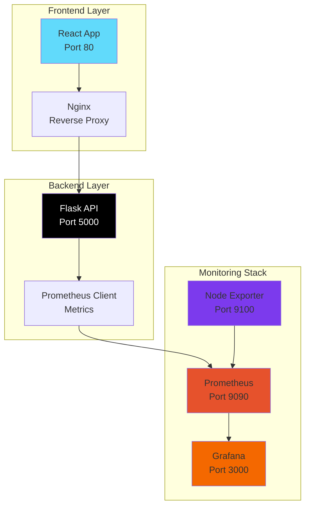

# 🚀 ReactWatch - Full-Stack Monitoring Dashboard

<div align="center">


**A modern full-stack application with comprehensive monitoring and observability**

[](https://opensource.org/licenses/MIT)
[](https://www.docker.com/)
[](https://grafana.com/)

</div>

---

## 📋 Table of Contents

- [🎯 Overview](#-overview)
- [🏗️ Architecture](#️-architecture)
- [🚀 Quick Start](#-quick-start)
- [🔧 Services & Ports](#-services--ports)
- [📊 Monitoring & Observability](#-monitoring--observability)
- [🛠️ Development](#️-development)
- [🐛 Debugging Commands](#-debugging-commands)
- [📈 Metrics & Dashboards](#-metrics--dashboards)
- [🔍 Troubleshooting](#-troubleshooting)
- [📁 Project Structure](#-project-structure)
- [🤝 Contributing](#-contributing)

---

## 🎯 Overview

**ReactWatch** is a comprehensive full-stack monitoring solution that combines a React frontend with a Flask backend, all containerized with Docker and monitored using Grafana and Prometheus. This project demonstrates modern DevOps practices with real-time system monitoring, metrics collection, and beautiful dashboards.

### ✨ Key Features

- 🎨 **Modern React Frontend** - Responsive UI with task management
- ⚡ **Flask REST API** - High-performance backend with CORS support
- 📊 **Real-time Monitoring** - Grafana dashboards with system metrics
- 🔍 **Metrics Collection** - Prometheus for time-series data
- 🐳 **Containerized** - Full Docker Compose setup
- 📈 **Health Checks** - Automated service health monitoring
- 🎛️ **Node Exporter** - System resource monitoring

---

## 🏗️ Architecture



---

## 🚀 Quick Start

### Prerequisites

- [Docker](https://www.docker.com/get-started) (v20.10+)
- [Docker Compose](https://docs.docker.com/compose/install/) (v2.0+)
- [Git](https://git-scm.com/)

### 1. Clone the Repository

```bash
git clone <repository-url>
cd ReactWatch
```

### 2. Start All Services

```bash
# Start all services in detached mode
docker-compose up -d

# Or start with logs visible
docker-compose up
```

### 3. Verify Services

```bash
# Check service status
docker-compose ps

# View logs
docker-compose logs -f
```

---

## 🔧 Services & Ports

| Service | Port | URL | Description |
|---------|------|-----|-------------|
| **Frontend** | 80 | http://localhost | React application with Nginx |
| **Backend API** | 5000 | http://localhost:5000 | Flask REST API |
| **Grafana** | 3000 | http://localhost:3000 | Monitoring dashboards |
| **Prometheus** | 9090 | http://localhost:9090 | Metrics collection |
| **Node Exporter** | 9100 | http://localhost:9100 | System metrics |

### 🔐 Default Credentials

- **Grafana**: `admin` / `admin`
- **Prometheus**: No authentication required

---

## 📊 Monitoring & Observability

### 🎛️ Grafana Dashboard

Access the comprehensive monitoring dashboard at **http://localhost:3000**

**Dashboard Features:**
- 📈 **CPU Usage** - Real-time CPU utilization with thresholds
- 💾 **Memory Usage** - RAM consumption and availability
- 🌐 **Network Traffic** - Incoming/outgoing network data
- 💿 **Disk I/O** - Read/write operations per second
- ⚖️ **System Load** - 1min, 5min, 15min load averages
- 🔥 **CPU Cores** - Heatmap of individual core usage
- 📋 **Top Processes** - Highest CPU consuming processes

### 📊 Prometheus Metrics

Access metrics at **http://localhost:9090**

**Available Metrics:**
- `request_count_total` - HTTP request counter by method and endpoint
- `node_cpu_seconds_total` - CPU time spent in different modes
- `node_memory_*` - Memory usage statistics
- `node_network_*` - Network interface statistics
- `node_disk_*` - Disk I/O statistics

---

## 🛠️ Development

### Backend Development

```bash
# Enter backend container
docker-compose exec backend bash

# Install new dependencies
pip install <package-name>

# Update requirements.txt
pip freeze > requirements.txt
```

### Frontend Development

```bash
# Enter frontend container
docker-compose exec frontend sh

# Install new dependencies
npm install <package-name>

# Build for production
npm run build
```

### Hot Reload Development

For development with hot reload, you can run services individually:

```bash
# Backend only
cd backend
python app.py

# Frontend only (requires Node.js)
cd frontend
npm start
```

---

## 🐛 Debugging Commands

### Service Health Checks

```bash
# Check all services status
docker-compose ps

# View service logs
docker-compose logs [service-name]

# Follow logs in real-time
docker-compose logs -f [service-name]

# Restart specific service
docker-compose restart [service-name]
```

### API Testing

```bash
# Test frontend
curl http://localhost

# Test backend API
curl http://localhost:5000/tasks

# Test metrics endpoint
curl http://localhost:5000/metrics

# Test Prometheus targets
curl http://localhost:9090/api/v1/targets
```

### Container Debugging

```bash
# Execute commands in running containers
docker-compose exec backend bash
docker-compose exec frontend sh
docker-compose exec grafana sh

# Check container resource usage
docker stats

# Inspect container configuration
docker-compose config
```

### Network Debugging

```bash
# Check network connectivity
docker-compose exec backend curl http://prometheus:9090
docker-compose exec backend curl http://node-exporter:9100

# List Docker networks
docker network ls

# Inspect network
docker network inspect reactwatch_app-network
```

### Log Analysis

```bash
# View all logs
docker-compose logs

# Filter logs by service
docker-compose logs backend | grep ERROR
docker-compose logs frontend | grep "Failed to compile"

# View logs with timestamps
docker-compose logs -t
```

---

## 📈 Metrics & Dashboards

### Custom Metrics

The Flask backend exposes custom metrics:

```python
# Request counter by method and endpoint
REQUEST_COUNT = Counter("request_count_total", "Total HTTP requests", ["method", "endpoint"])
```

### Prometheus Queries

Useful PromQL queries for monitoring:

```promql
# Request rate per second
rate(request_count_total[5m])

# CPU usage percentage
100 - (avg by(instance) (rate(node_cpu_seconds_total{mode="idle"}[5m])) * 100)

# Memory usage percentage
((node_memory_MemTotal_bytes - node_memory_MemAvailable_bytes) / node_memory_MemTotal_bytes) * 100

# Top 5 processes by CPU
topk(5, rate(node_cpu_seconds_total{mode!="idle"}[5m]))
```

### Dashboard URLs

- **Grafana Home**: http://localhost:3000
- **System Dashboard**: http://localhost:3000/d/system-monitoring-dashboard
- **Prometheus Targets**: http://localhost:9090/targets
- **Prometheus Graph**: http://localhost:9090/graph

---

## 🔍 Troubleshooting

### Common Issues

#### 1. Services Not Starting

```bash
# Check Docker daemon
docker --version
docker-compose --version

# Check port conflicts
netstat -tulpn | grep :80
netstat -tulpn | grep :3000
netstat -tulpn | grep :5000
netstat -tulpn | grep :9090
```

#### 2. Frontend Not Loading

```bash
# Check Nginx configuration
docker-compose exec frontend cat /etc/nginx/nginx.conf

# Test Nginx
docker-compose exec frontend nginx -t

# Check frontend build
docker-compose exec frontend ls -la /usr/share/nginx/html
```

#### 3. Backend API Issues

```bash
# Check Flask logs
docker-compose logs backend

# Test API directly
curl -v http://localhost:5000/tasks

# Check CORS configuration
curl -H "Origin: http://localhost" http://localhost:5000/tasks
```

#### 4. Monitoring Issues

```bash
# Check Prometheus targets
curl http://localhost:9090/api/v1/targets

# Verify metrics collection
curl http://localhost:5000/metrics

# Check Grafana datasource
curl -u admin:admin http://localhost:3000/api/datasources
```

### Performance Optimization

```bash
# Monitor resource usage
docker stats --no-stream

# Check container health
docker-compose ps

# Optimize Docker build
docker system prune -f
```

---

## 📁 Project Structure

```
ReactWatch/
├── 📁 backend/                 # Flask API
│   ├── app.py                 # Main Flask application
│   ├── requirements.txt       # Python dependencies
│   └── Dockerfile            # Backend container config
├── 📁 frontend/               # React application
│   ├── src/                  # React source code
│   ├── public/               # Static assets
│   ├── package.json          # Node.js dependencies
│   ├── Dockerfile           # Frontend container config
│   └── nginx.conf           # Nginx configuration
├── 📁 grafana/               # Grafana configuration
│   ├── conf/                # Grafana settings
│   ├── dashboards/          # Dashboard definitions
│   └── provisioning/        # Auto-provisioning config
├── 📁 prometheus/            # Prometheus configuration
│   └── prometheus.yml       # Scrape configuration
├── docker-compose.yml        # Multi-container orchestration
└── README.md                # This file
```

---

## 🤝 Contributing

We welcome contributions! Please follow these steps:

1. **Fork** the repository
2. **Create** a feature branch (`git checkout -b feature/amazing-feature`)
3. **Commit** your changes (`git commit -m 'Add amazing feature'`)
4. **Push** to the branch (`git push origin feature/amazing-feature`)
5. **Open** a Pull Request

### Development Guidelines

- Follow existing code style and patterns
- Add tests for new features
- Update documentation as needed
- Ensure all services start successfully
- Test monitoring and metrics collection

---

## 📄 License

This project is licensed under the MIT License - see the [LICENSE](LICENSE) file for details.

---

<div align="center">

**Made with ❤️ for modern monitoring and observability**

[](https://github.com/Sufiyan0114/ReactWatch)
[](https://github.com/Sufiyan0114/ReactWatch)

</div>